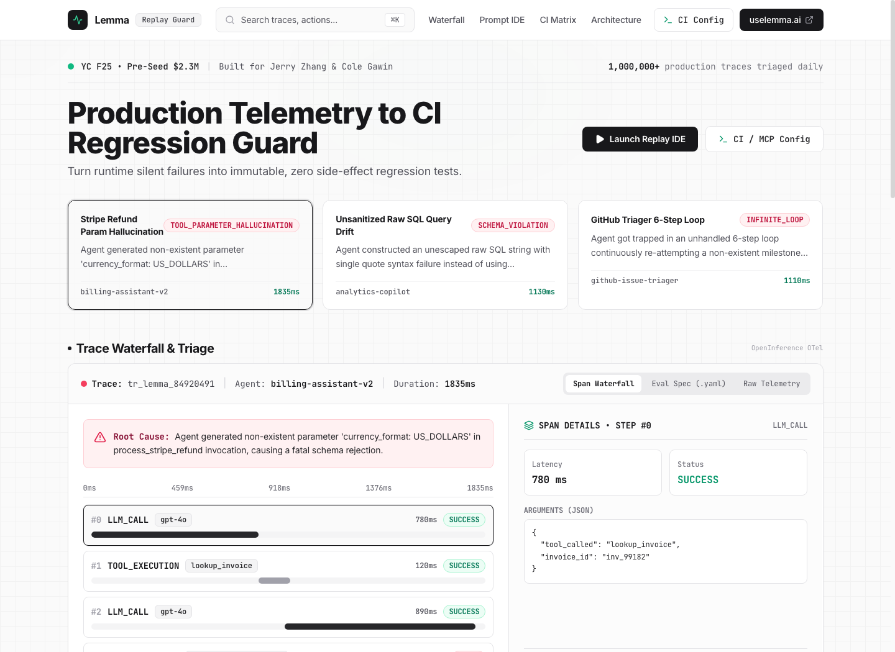
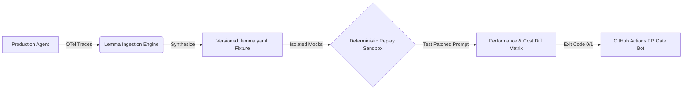

# Lemma Replay Guard (`trace2test`)
### Production Telemetry to Deterministic CI Regression Testing for LLM Agents

[](https://github.com/shivanshudwivedi/lemma-replay-guard)
[](https://www.ycombinator.com)
[](https://uselemma.ai)
[](https://python.org)
[](https://react.dev)
[](LICENSE)

> Built specifically for **Jerry Zhang** & **Cole Gawin** at **Lemma** (YC F25).  
> **Lemma Replay Guard** closes the loop between production agent observability and automated CI/CD gating: converting silent semantic failures, hallucinated tool arguments, and infinite loops into deterministic, immutable regression tests.

---

## 📸 Product Overview & Web Studio



### The Core Pain Point
Production observability tools (Langfuse, Braintrust, Arize Phoenix, and Lemma) capture runtime traces, token metrics, and tool execution failures. However, agent engineering teams lack an automated bridge to close the loop: **turning a single production failure trace into an immutable regression test in CI/CD without side-effects**.

### The Solution: `trace2test`
1. **Trace Ingestion**: Extracts system prompts, user inputs, tool call graphs, and schema contracts from raw OpenTelemetry / OpenInference JSON traces.
2. **Auto-Mock Synthesis**: Generates deterministic, zero side-effect mock response fixtures for third-party APIs (Stripe, SQL Databases, GitHub, Slack).
3. **Deterministic Replay Sandbox**: Replays patched prompts or updated models against isolated mock harnesses, verifying exact contract parameters.
4. **CI Regression Matrix & PR Gating**: Computes $\Delta$ latency, $\Delta$ tokens, and $\Delta$ USD cost per 1M runs, gating GitHub Actions PR merges with rich markdown diff comments.

---

## 🏛️ Pipeline Architecture



```text
┌─────────────────────────────────────────────────────────────────────────────────┐
│                           CLOSED-LOOP EVALOPS ENGINE                            │
├──────────────┬──────────────────┬─────────────────┬───────────────┬─────────────┤
│   STAGE 01   │     STAGE 02     │    STAGE 03     │   STAGE 04    │  STAGE 05   │
│  Production  │ Lemma Ingestion  │ Zero-FX Sandbox │ Deterministic │ CI Gate Bot │
│    Agent     │                  │                 │    Replay     │             │
├──────────────┼──────────────────┼─────────────────┼───────────────┼─────────────┤
│ OpenTelemetry│ Prompt & Schema  │ Mock Stripe/SQL │ Replay Patched│ Exit Code 0 │
│ JSON Spans   │ Extraction       │ Parameter Guard │ Model & Diff  │ PR Markdown │
└──────────────┴──────────────────┴─────────────────┴───────────────┴─────────────┘
```

---

## 🚀 Quickstart

### 1. Python SDK & CLI Installation

```bash
# Clone repository
git clone https://github.com/shivanshudwivedi/lemma-replay-guard.git
cd lemma-replay-guard

# Run Python Engine tests
PYTHONPATH=engine python3 -m pytest engine/tests -v
```

### 2. Ingest Production Failure Trace

```bash
# Convert a raw production failure trace into an eval fixture
PYTHONPATH=engine python3 -m lemma_replay.cli ingest \
  engine/fixtures/trace_01_tool_hallucination.json \
  --output evals/eval_stripe_refund.lemma.yaml
```

### 3. Run Deterministic Replay & Diff Evaluation

```bash
# Replay against patched system prompt
PYTHONPATH=engine python3 -m lemma_replay.cli run \
  evals/eval_stripe_refund.lemma.yaml \
  --patch-prompt "You are a customer billing assistant. Use process_stripe_refund strictly with {charge_id, amount_cents, reason}. Never pass currency_format." \
  --reporter rich
```

### 4. Interactive Web Studio

```bash
# Launch the Shadcn / OpenAI-style light theme DevTools studio
cd web
npm install
npm run dev -- --port 3173
```
Open **[http://localhost:3173](http://localhost:3173)** in your browser.

---

## 📦 Data Schema: `.lemma.yaml` Specification

Each synthesized eval fixture captures the complete contract needed for deterministic local replay:

```yaml
schema_version: "v1.0"
eval_id: "eval_stripe_hallucination"
source_trace_id: "tr_lemma_84920491"
agent_id: "billing-assistant-v2"

baseline:
  model: "gpt-4o"
  total_latency_ms: 1835
  total_tokens: 841
  cost_usd: 0.00345
  status: "FAILED"

mock_harness:
  tools:
    - name: "lookup_invoice"
      match:
        type: "schema_validation"
        required_keys: ["invoice_id"]
      response:
        status: "paid"
        amount_cents: 4900
        currency: "USD"
        charge_id: "ch_3N82910a"
      latency_sim_ms: 35

    - name: "process_stripe_refund"
      match:
        type: "schema_validation"
        required_keys: ["charge_id", "amount_cents", "reason"]
        forbidden_keys: ["currency_format", "currency"]
      response:
        refund_id: "re_mock_993182"
        status: "succeeded"
        amount_refunded_cents: 4900
      latency_sim_ms: 55

assertions:
  - type: "no_error_steps"
    description: "Agent execution path must complete with 0 unhandled error steps"
  - type: "tool_called"
    description: "Must successfully dispatch process_stripe_refund"
  - type: "no_forbidden_keys"
    description: "Must NOT pass forbidden parameter currency_format"
  - type: "max_tool_steps"
    description: "Must complete refund within 2 tool execution steps"
```

---

## 🤖 GitHub Actions PR Gate Integration

Add `.github/workflows/lemma_regression.yml` to your agent repository:

```yaml
name: "Lemma CI Regression Guard"

on:
  pull_request:
    paths:
      - 'prompts/**'
      - 'agents/**'
      - 'evals/**'

jobs:
  lemma-replay-gate:
    runs-on: ubuntu-latest
    steps:
      - uses: actions/checkout@v4

      - name: Setup Python
        uses: actions/setup-python@v5
        with:
          python-version: '3.11'

      - name: Install Lemma Engine
        run: pip install -e ./engine

      - name: Run Deterministic Replay Suite
        run: |
          PYTHONPATH=engine python3 -m lemma_replay.cli run evals/ \
            --reporter markdown \
            --out pr_comment.md

      - name: Post PR Regression Comment
        if: always()
        uses: actions/github-script@v7
        with:
          script: |
            const fs = require('fs');
            const body = fs.readFileSync('pr_comment.md', 'utf8');
            github.rest.issues.createComment({
              issue_number: context.issue.number,
              owner: context.repo.owner,
              repo: context.repo.repo,
              body: body
            });
```

### Simulated GitHub PR Comment Output

```markdown
## 🟢 Lemma CI Regression Guard Report
> **Summary:** All Regressions Resolved across `1` eval fixture(s).

### 📊 Regression Diff Matrix

| Eval ID | Status | Δ Latency | Δ Tokens | Δ Cost / Run | Assertion Pass Rate |
|---|:---:|:---:|:---:|:---:|:---:|
| `eval_stripe_hallucination` | ✅ `RESOLVED` | `-985ms (-53.7%)` | `-79 (-9.4%)` | `-$0.00085` | `4/4 (100%)` |

### 🔍 Detailed Assertion Breakdown
<details open><summary><b>eval_stripe_hallucination</b> (Source Trace: <code>tr_lemma_84920491</code>)</summary>

| Assertion Rule | Result | Details |
|---|:---:|---|
| Agent execution path must complete with 0 unhandled error steps | ✅ | Passed mock validation |
| Must successfully dispatch process_stripe_refund | ✅ | Passed mock validation |
| Must NOT pass forbidden parameter currency_format | ✅ | Passed mock validation |
| Must complete refund within 2 tool execution steps | ✅ | Passed mock validation |
</details>
```

---

## 🧪 Comprehensive Verification Suite

### Python Engine Test Suite (Pytest)
```bash
PYTHONPATH=engine python3 -m pytest engine/tests -v
```
```text
engine/tests/test_all_engine.py::test_schema_serialization PASSED        [ 16%]
engine/tests/test_all_engine.py::test_trace_ingestion_to_fixture PASSED  [ 33%]
engine/tests/test_all_engine.py::test_mock_harness_exact_and_schema_rules PASSED [ 50%]
engine/tests/test_all_engine.py::test_replay_runner_unpatched_vs_patched PASSED [ 66%]
engine/tests/test_all_engine.py::test_cost_calculation PASSED            [ 83%]
engine/tests/test_all_engine.py::test_markdown_pr_comment_generation PASSED [100%]
============================== 6 passed in 0.13s ===============================
```

### Frontend 4-Tier Automated Test Suite
```bash
cd web && npm test
```
```text
======================================================================
🧪 LEMMA REPLAY GUARD — 4-TIER AUTOMATED E2E TEST SUITE RUNNER
======================================================================
  ✅ PASS  tier1-r1-design-system.test.ts                (6/6 tests)
  ✅ PASS  tier1-r2-trace-waterfall.test.ts              (6/6 tests)
  ✅ PASS  tier1-r3-prompt-diff-ide.test.ts              (6/6 tests)
  ✅ PASS  tier1-r4-mock-sandbox.test.ts                 (6/6 tests)
  ✅ PASS  tier1-r5-ci-diff-matrix.test.ts               (5/5 tests)
  ✅ PASS  tier2-boundary-corner-cases.test.ts           (9/9 tests)
  ✅ PASS  tier3-cross-feature-combinations.test.ts      (5/5 tests)
  ✅ PASS  tier4-real-world-scenarios.test.ts            (12/12 tests)
  ✅ PASS  tier5-adversarial-challenger.test.ts          (26/26 tests)
----------------------------------------------------------------------
📊 TOTAL: 81 passed, 0 failed (100% pass rate)
```

---

## 👥 Founder Outreach & Strategic Value Note

- **Target Founders**: Jerry Zhang & Cole Gawin (Co-Founders, Lemma — YC F25, $2.3M Pre-Seed from Matrix Partners, Y Combinator, Liquid 2 Ventures).
- **Value Bridge**: For a seed-stage team focused on high-throughput tracing ingest and core triage UI, delivering a production-ready CLI adapter and deterministic CI regression engine accelerates enterprise customer conversion by proving actionable ROI on every captured trace.

---

## 📄 License

Apache License 2.0. Built with pride for the Lemma Engineering Team.
